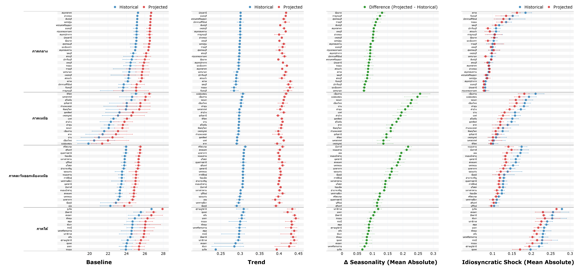
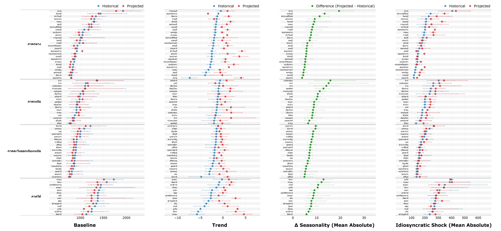
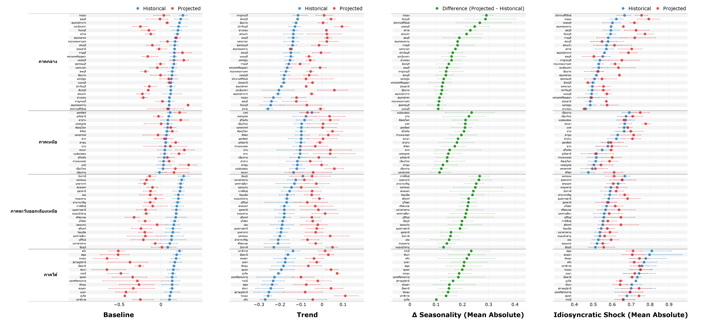

import Ab202516Fig1A from "./Ab202516Fig1A.js"
import Ab202516Fig1B from "./Ab202516Fig1B.js"
import Ab202516Fig1C from "./Ab202516Fig1C.js"

import Ab202516Fig4A1 from "./Ab202516Fig4A1.js"
import Ab202516Fig4A2 from "./Ab202516Fig4A2.js"
import Ab202516Fig4A3 from "./Ab202516Fig4A3.js"
import Ab202516Fig4A4 from "./Ab202516Fig4A4.js"
import Ab202516Fig4B1 from "./Ab202516Fig4B1.js"
import Ab202516Fig4B2 from "./Ab202516Fig4B2.js"
import Ab202516Fig4B3 from "./Ab202516Fig4B3.js"
import Ab202516Fig4B4 from "./Ab202516Fig4B4.js"
import Ab202516Fig4C1 from "./Ab202516Fig4C1.js"
import Ab202516Fig4C2 from "./Ab202516Fig4C2.js"
import Ab202516Fig4C3 from "./Ab202516Fig4C3.js"
import Ab202516Fig4C4 from "./Ab202516Fig4C4.js"

import Ab202516Fig5A from "./Ab202516Fig5A.js"
import Ab202516Fig5B from "./Ab202516Fig5B.js"
import Ab202516Fig5C from "./Ab202516Fig5C.js"

import Ab202516Fig6 from "./Ab202516Fig6.js"
import Ab202516Fig7 from "./Ab202516Fig7.js"
import Ab202516Fig8 from "./Ab202516Fig8.js"
import Ab202516Fig9 from "./Ab202516Fig9.js"

:::excerpt
บทความนี้ใช้ข้อมูลสภาพอากาศรายเดือน ทั้งในอดีตและการคาดการณ์ในอนาคตรวมกว่า 80 ปี ครอบคลุมทุกอำเภอทั่วประเทศ เพื่อจำแนกลักษณะของการเปลี่ยนแปลงสภาพภูมิอากาศออกเป็น (1) การเปลี่ยนแปลงที่สามารถคาดการณ์ได้ล่วงหน้า เช่น การเปลี่ยนแปลงของแนวโน้ม หรือฤดูกาล ซึ่งเหมาะกับมาตรการปรับตัวเชิงรุก และ (2) การเปลี่ยนแปลงที่ไม่สามารถคาดการณ์ได้ล่วงหน้า ซึ่งจำเป็นต้องอาศัยกลไกการบริหารจัดการความเสี่ยงที่เหมาะสมตามลักษณะของความเสี่ยง บทความนี้ยังแสดงให้เห็นว่าการเปลี่ยนแปลงของสภาพภูมิอากาศในแต่ละลักษณะมีผลต่อผลผลิตต่อไร่ของพืชเศรษฐกิจและการชำระหนี้ของพอร์ตสินเชื่อเกษตรต่างกันไป และต่างกันในแต่ละพื้นที่ของประเทศ ผลการศึกษานี้จึงช่วยสะท้อนระดับการเผชิญความเสี่ยง (exposure) และความเปราะบาง (vulnerability) ต่อการเปลี่ยนแปลงสภาพภูมิอากาศที่ละเอียดขึ้น และเป็นรากฐานสำคัญต่อการออกแบบนโยบายที่ตรงจุด
:::

น้ำท่วมในภาคใต้ที่ผ่านมาสะท้อนให้เห็นว่าการเปลี่ยนแปลงสภาพภูมิอากาศอาจกำลังเกิดขึ้นในลักษณะที่ไม่สามารถคาดการณ์ได้ล่วงหน้ามากขึ้นเรื่อย ๆ เมื่อมองไปข้างหน้า คำถามสำคัญคือการเปลี่ยนแปลงสภาพภูมิอากาศของประเทศไทยมีลักษณะอย่างไร แตกต่างกันอย่างไรในภูมิภาคต่าง ๆ ของประเทศ และลักษณะการเปลี่ยนแปลงสภาพภูมิอากาศแบบใดที่ระบบเศรษฐกิจและสังคมยังไม่สามารถรับมือได้อย่างมีประสิทธิภาพ อย่างไรก็ดี คำถามเหล่านี้ยังขาดหลักฐานเชิงประจักษ์ที่ช่วยตอบโจทย์การกำหนดนโยบายได้อย่างชัดเจน

ที่ผ่านมามีงานศึกษาจำนวนมากชี้ให้เห็นว่า ผลกระทบจากการเปลี่ยนแปลงสภาพภูมิอากาศมักเกิดจากความผันผวนที่เพิ่มขึ้นมากกว่าการเปลี่ยนแปลงของสภาพอากาศโดยเฉลี่ย [@Baltisti2009; @Lee2021] และความผันผวนดังกล่าวสามารถส่งผลต่อเศรษฐกิจอย่างรุนแรงและไม่เป็นเส้นตรง [@Schlenker2009; @Burke2015; @Carleton2016] นอกจากนี้ ความผันผวนของสภาพภูมิอากาศที่มีลักษณะแตกต่างกันยังต้องอาศัยแนวทางการรับมือที่แตกต่างกัน [@Burney2024; @Deschenes2007; @Portner2022] โดยการเปลี่ยนแปลงที่สามารถคาดการณ์ได้ล่วงหน้ามักจัดการได้ผ่านการปรับตัวในระดับบุคคลและชุมชน ขณะที่การเปลี่ยนแปลงที่ไม่สามารถคาดการณ์ได้จำเป็นต้องพึ่งพากลไกการบริหารจัดการความเสี่ยงในระดับระบบ

อย่างไรก็ตาม ข้อจำกัดสำคัญของงานวิจัยเหล่านี้คือ การพิจารณาการเปลี่ยนแปลงสภาพภูมิอากาศเพียงมิติเดียว โดยแต่ละงานมักเลือกใช้ตัวชี้วัดด้านภูมิอากาศเพียงบางประเภท ไม่ว่าจะเป็นค่าเฉลี่ยของปริมาณน้ำฝนและอุณหภูมิ [@Alemu2024] หรือเหตุการณ์สภาพอากาศสุดขั้ว [@Lesk2022] และยังไม่ได้พิจารณาและเปรียบเทียบลักษณะต่าง ๆ ของการเปลี่ยนแปลงสภาพภูมิอากาศในภาพรวม ทำให้ยังขาดความเข้าใจเชิงลึกในการตอบโจทย์นโยบายข้างต้น และอาจนำไปสู่การออกแบบมาตรการปรับตัวที่ยังไม่สอดคล้องกับลักษณะของการเปลี่ยนแปลงอย่างแท้จริง

บทความนี้ช่วยเติมเต็มองค์ความรู้และตอบคำถามเชิงนโยบายข้างต้น โดยอาศัยกรอบแนวคิดตาม @Burney2024 เพื่อทำความเข้าใจการเปลี่ยนแปลงสภาพภูมิอากาศของประเทศไทยในหลายมิติอย่างลึกซึ้งยิ่งขึ้น พร้อมทั้งประเมินระดับการเผชิญความเสี่ยงและความเปราะบางต่อการเปลี่ยนแปลงสภาพภูมิอากาศของภาคเกษตรและพอร์ตสินเชื่อเกษตรทั้งในระดับประเทศและระดับพื้นที่ ซึ่งผลการศึกษานี้จะช่วยสนับสนุนให้ผู้กำหนดนโยบายสามารถออกแบบมาตรการรับมือกับการเปลี่ยนแปลงสภาพภูมิอากาศได้อย่างตรงจุด สอดคล้องกับบริบทของพื้นที่ และมีประสิทธิภาพมากยิ่งขึ้น

# ข้อมูลสภาพภูมิอากาศของไทย

บทความนี้ใช้ข้อมูลสภาพอากาศรายเดือน ครอบคลุมช่วงเวลาอดีต (1990–2024) และช่วงเวลาอนาคต (2025–2070) ภายใต้ฉากทัศน์ RCP 8.5 ซึ่งเป็นฉากทัศน์ที่การเปลี่ยนแปลงสภาพภูมิอากาศมีความรุนแรง โดยพิจารณาจากความพยายามและความคืบหน้าของการลดก๊าซเรือนกระจกของประเทศไทยในช่วงที่ผ่านมา ข้อมูลนี้ได้มาจากโครงการ Coupled Model Intercomparison Project Phase 5 (CMIP5) โดยใช้วิธีการขยายความละเอียดเชิงพื้นที่ของแบบจำลองภูมิอากาศโลกผ่านกระบวนการย่อส่วนเชิงพลวัต (dynamical downscaling) ให้มีความละเอียดเชิงพื้นที่ขนาด 25 กิโลเมตร × 25 กิโลเมตร ซึ่งมีขนาดใกล้เคียงกับอำเภอขนาดใหญ่ของประเทศไทย ทั้งนี้ เพื่อให้สามารถเปรียบเทียบผลการศึกษากับงานวิจัยในต่างประเทศได้ บทความนี้จึงใช้ตัวแปรด้านภูมิอากาศพื้นฐาน ได้แก่ อุณหภูมิและปริมาณน้ำฝนเป็นจุดตั้งต้นของการวิเคราะห์

นอกจากนี้ เราได้เพิ่มการใช้ดัชนี SPI (Standardized Precipitation Index) เพื่อสะท้อนเหตุการณ์สภาพอากาศสุดขั้วได้ดียิ่งขึ้น โดยดัชนี SPI เป็นตัวชี้วัดเชิงสถิติที่ใช้ประเมินภาวะความแห้งแล้ง โดยพิจารณาจากความเบี่ยงเบนของปริมาณฝนจริงเมื่อเทียบกับสภาพภูมิอากาศในระยะยาวของพื้นที่นั้น [@McKee1993] และสามารถใช้ประเมินความผิดปกติของปริมาณฝน ทั้งในลักษณะฝนทิ้งช่วงและฝนตกหนักได้ ในบทความนี้ใช้ดัชนี SPI-3 ซึ่งสะท้อนความผิดปกติของปริมาณฝนในช่วงเวลา 3 เดือน และเหมาะสมกับการติดตามความแห้งแล้งที่ส่งผลกระทบโดยตรงต่อภาคเกษตร โดยค่าดัชนี SPI ที่เป็นลบสะท้อนปริมาณฝนที่ต่ำกว่าค่าปกติหรือภาวะแห้งแล้ง ขณะที่ค่าดัชนีที่เป็นบวกสะท้อนปริมาณฝนที่สูงกว่าค่าปกติซึ่งอาจบ่งชี้ภาวะน้ำท่วม ส่วนค่าที่ใกล้ศูนย์สะท้อนสภาวะปริมาณฝนใกล้เคียงปกติ

รูปที่ 1 แสดงแนวโน้มของอุณหภูมิเฉลี่ย ปริมาณน้ำฝนสะสม และดัชนี SPI-3 รายปีในระดับอำเภอ ระหว่างปี 1990-2070 และแสดงให้เห็นว่า ค่าเฉลี่ยของตัวแปรด้านภูมิอากาศของประเทศไทย โดยเฉพาะอุณหภูมิมีแนวโน้มเพิ่มสูงขึ้นในอนาคต โดยเพิ่มขึ้นประมาณ 1.27 องศาเซลเซียสเมื่อเปรียบเทียบระหว่างช่วงเวลาอดีตและอนาคต ขณะเดียวกัน ระดับความแปรปรวนของตัวแปรด้านภูมิอากาศเพิ่มขึ้นในทุกมิติ โดยเฉพาะปริมาณน้ำฝนและดัชนี SPI-3 ซึ่งสะท้อนถึงความเสี่ยงจากเหตุการณ์สภาพอากาศสุดขั้วที่มีแนวโน้มเพิ่มสูงขึ้น เช่น การเกิดฝนตกหนักผิดปกติสลับกับช่วงแห้งแล้ง ซึ่งผลการศึกษานี้สอดคล้องกับหลักฐานจากงานวิจัยอื่น ๆ [@IPCC2023] [^1]

[^1]: รายงานสังเคราะห์การประเมินสถานการณ์ด้านการเปลี่ยนแปลงสภาพภูมิอากาศ ฉบับที่ 6 ของคณะกรรมการระหว่างรัฐบาลว่าด้วยการเปลี่ยนแปลงสภาพภูมิอากาศ (IPCC AR6) ระบุว่า อุณหภูมิเฉลี่ยผิวโลกเพิ่มขึ้นประมาณ 1.1 องศาเซลเซียส เมื่อเทียบกับช่วงก่อนยุคอุตสาหกรรมและคาดว่า อุณหภูมิเฉลี่ยพื้นผิวโลกจะเพิ่มขึ้นเกิน 1.5–2 องศาเซลเซียสภายในศตวรรษที่ 21 ภายใต้แนวโน้มการปล่อยก๊าซเรือนกระจกในปัจจุบัน การเพิ่มขึ้นของอุณหภูมิเฉลี่ยดังกล่าวส่งผลให้เกิดการเปลี่ยนแปลงในรูปแบบและความแปรปรวนของระบบภูมิอากาศทั่วโลก และมีการคาดการณ์ว่าเหตุการณ์ฝนตกหนักจะเกิดบ่อยครั้งขึ้นและมีความรุนแรงมากขึ้น อีกทั้งน้ำฝนมีการกระจายตัวที่ไม่สม่ำเสมอและความเสี่ยงของอุทกภัยและภัยแล้งเพิ่มสูงขึ้น

<!-- fig -->

* **รูปที่ 1**: อุณหภูมิเฉลี่ย ปริมาณน้ำฝนสะสม และดัชนี SPI-3 รายปีของประเทศไทยระหว่างปี 1990–2070  

<Ab202516Fig1A/>
<Ab202516Fig1B/>
<Ab202516Fig1C/>

* **ที่มา**: CMIP5, RU-CORE คำนวณโดยคณะผู้เขียน
* **หมายเหตุ**: เส้นทึบแสดงค่า Median ในแต่ละปีของตัวแปรด้านภูมิอากาศรายอำเภอ กล่องสี่เหลี่ยมแสดงค่า percentile ที่ 25 และ 75 และเส้นแนวตั้งแสดงค่าสูงสุดและต่ำสุด ข้อมูลห้วงเวลาอดีต ตั้งแต่ปี 1990–2024

<!-- endfig -->

# การจำแนกลักษณะการเปลี่ยนแปลงสภาพภูมิอากาศของประเทศไทย

งานวิจัยนี้ใช้แบบจำลองเชิงเส้นในการแยกลักษณะการเปลี่ยนแปลงของแต่ละตัวแปรอากาศ (spatiotemporal decomposition) ออกเป็น 

**ส่วนแรก** คือการเปลี่ยนแปลงที่สามารถคาดการณ์ได้ล่วงหน้า (anticipated change) ซึ่งประกอบไปด้วย
 1. *ระดับของตัวแปรอากาศตั้งต้น (baseline)* ซึ่งเป็น intercept ในแบบจำลอง
 2. *แนวโน้มการเปลี่ยนแปลง (trend)* ซึ่งมาจากการใส่ time trend ในแบบจำลอง
 3. *ฤดูกาล (seasonality)* ซึ่งหามาจากการนำส่วนของตัวแปรอากาศหลังจากหัก intercept และ time trend ออกไป แล้วมาหาค่าเฉลี่ยแต่ละเดือนของปี

**ส่วนที่สอง** คือการเปลี่ยนแปลงที่ไม่สามารถคาดการณ์ได้ล่วงหน้า (unanticipated change) ซึ่งประกอบไปด้วย
 1. *เหตุการณ์ที่ไม่คาดคิดที่เกิดขึ้นและส่งผลในวงกว้างพร้อมกันทั้งประเทศ (covariate shocks)* ซึ่งหามาจากการนำเอาตัวแปรอากาศหลังหัก intercept, time trend และ seasonality ออกไป มาหาค่าเฉลี่ยในแต่ละเดือนในระดับประเทศ
 2. *เหตุการณ์ไม่คาดคิดที่ส่งผลกระทบเฉพาะเจาะจงต่อบุคคลหรือเฉพาะพื้นที่ แต่ไม่ได้ส่งผลกระทบในวงกว้าง (idiosyncratic shocks)* ซึ่งเป็นส่วนของตัวแปรอากาศที่โดนหัก covariate shock ออกไป[^2]

[^2]: รายละเอียดวิธีที่ใช้ในการแยกลักษณะการเปลี่ยนแปลงของตัวแปรด้านภูมิอากาศ (X) มีดังนี้ (1) เริ่มต้นจากข้อมูลค่าเฉลี่ยรายเดือนของอุณหภูมิ น้ำฝน และดัชนี SPI-3 ในอดีตครอบคลุมปี 1990-2024 ที่ระดับอำเภอ (2) สร้างแบบจำลองเชิงเส้น ซึ่งทำให้ได้ค่า baseline (X ̂_io≡E(X_i0)) และแนวโน้มระยะยาว (time trend) (X ̂_(〖trend〗it )≡E_t (X_it)) ของอุณหภูมิ น้ำฝน และดัชนี SPI-3 รายอำเภอ i (3) คำนวณความเป็นฤดูกาล (seasonality) โดยนำข้อมูลตัวแปรด้านภูมิอากาศระดับอำเภอในแต่ละเดือน m ลบกับค่า baseline และแนวโน้มระยะยาวที่คำนวณได้จากขั้นตอนที่ (2) X ̅_im≡E_m (X_imt-X ̂_io-X ̂(〖trend〗it ) ) (4) นำค่า residual ที่ได้หรือ total shocks มาแยกองค์ประกอบออกเป็น covariate shocks และ idiosyncratic shocks โดย covariate shocks ในบทความนี้คำนวณในระดับประเทศ โดยคำนวณจาก X ̂(〖shock〗mt )≡E_t (X_imt-(X ̂_io+X ̂(〖trend〗it )+ X ̅_im )) และคำนวณ idiosyncratic shock โดยคำนวณจาก X ̂(〖shock〗imt )≡X_imt-(X ̂_io+X ̂(〖trend〗it )+ X ̅_im+X ̂(〖shock〗_mt ) ) (5) ใช้วิธีเดียวกันนี้กับตัวแปรอากาศในอนาคต (2025–2070)

รูปที่ 2 แสดงตัวอย่างของผลการจำแนกลักษณะการเปลี่ยนแปลงของปริมาณน้ำฝนสะสมรายเดือนใน 6 พื้นที่ รูป 2a แสดงผลองค์ประกอบในส่วนของการเปลี่ยนแปลงที่สามารถคาดการณ์ได้ล่วงหน้า ประกอบไปด้วยระดับปริมาณน้ำฝนตั้งต้นที่มีความแตกต่างกันระหว่างพื้นที่ แนวโน้มที่มีทิศทางลดลงในทุกพื้นที่ และฤดูกาล ซึ่งมีความความแตกต่างกันระหว่างพื้นที่ และรูป 2b แสดงส่วนของการเปลี่ยนแปลงที่ไม่สามารถคาดการณ์ได้ล่วงหน้าทั้งหมด และแยกเป็น covariate shocks และ idiosyncratic shocks ที่มีความแปรปรวนสูงและกระจายตัวแตกต่างกันตามพื้นที่

<!-- fig -->

* **รูปที่ 2**: ผลการแยกลักษณะต่าง ๆ ของการเปลี่ยนแปลงของปริมาณน้ำฝนในอดีต (6 พื้นที่ตัวอย่าง)  

* **ที่มา**: CMIP5, RU-CORE คำนวณโดยคณะผู้เขียน

<!-- endfig -->

รูปที่ 3 แสดงผลการแยกลักษณะของตัวแปรด้านภูมิอากาศโดยใช้ข้อมูลระหว่างปี 1990-2024 ซึ่งสะท้อนความแตกต่างเชิงพื้นที่อย่างชัดเจน ภาคเหนือมีค่าระดับฐานของอุณหภูมิเฉลี่ยต่ำกว่าภูมิภาคอื่น ๆ ขณะที่ทุกภูมิภาคของประเทศไทยมีแนวโน้มเผชิญอุณหภูมิที่สูงขึ้น แม้การเพิ่มขึ้นจะน้อยกว่าในพื้นที่ตอนกลางของประเทศ ในด้านปริมาณน้ำฝน พบความแตกต่างเชิงพื้นที่ค่อนข้างมาก แต่มีแนวโน้มลดลงในทุกภูมิภาค สะท้อนถึงสภาวะแห้งแล้งที่เพิ่มขึ้นในช่วงที่ผ่านมา ซึ่งสอดคล้องกับการเปลี่ยนแปลงของดัชนี SPI-3 นอกจากนี้ ยังพบว่า unanticipated shocks ของตัวแปรด้านภูมิอากาศทั้งสามมีลักษณะแตกต่างกันตามพื้นที่ โดยภาคใต้และภาคเหนือตอนบนเผชิญกับ idiosyncratic shocks ในระดับที่สูงกว่า ขณะที่ภาคกลางและภาคตะวันออกเฉียงเหนือเผชิญกับ covariate shocksมากกว่า

<!-- fig -->

* **รูปที่ 3**: ผลการแยกลักษณะต่าง ๆ ของการเปลี่ยนแปลงของตัวแปรด้านภูมิอากาศในอดีต  

* **ที่มา**: CMIP5, RU-CORE คำนวณโดยคณะผู้เขียน
* **หมายเหตุ**: ข้อมูลองค์ประกอบตัวแปรด้านภูมิอากาศระดับอำเภอ เส้นขอบแสดงในระดับจังหวัด หน่วยของปริมาณน้ำฝนเป็นมิลลิเมตรต่อปี

<!-- endfig -->

# เข้าใจลักษณะของการเปลี่ยนแปลงสภาพภูมิอากาศในอนาคตของไทย

รูปที่ 4 แสดงการเปรียบเทียบการเปลี่ยนแปลงของ baseline trend และ idiosyncratic shocks ระหว่างช่วงเวลาอดีต (แสดงด้วยสีแดง) และช่วงเวลาอนาคต (แสดงด้วยสีน้ำเงิน) รวมถึงการเปลี่ยนแปลงของฤดูกาลเมื่อเปรียบเทียบระหว่างสองช่วงเวลา (แสดงด้วยสีเขียว) ในระดับจังหวัดและภูมิภาค ขณะที่รูปที่ 5 แสดงการเปลี่ยนแปลงของ covariate shocks

สำหรับอุณหภูมิ (รูปที่ 4a) พบว่าการเปลี่ยนแปลงหลัก คือการเพิ่มขึ้นของ baseline และ trend ในอนาคตในทุกจังหวัด ขณะเดียวกันยังพบการเปลี่ยนแปลงของฤดูกาลโดยเฉพาะในภาคเหนือและภาคตะวันออกเฉียงเหนือ แต่ไม่พบการเปลี่ยนแปลงของความผันผวนที่ไม่สามารถคาดการณ์ได้อย่างมีนัยสำคัญ

สำหรับปริมาณน้ำฝน (รูปที่ 4b) การเปลี่ยนแปลงมีความแตกต่างกันค่อนข้างมากในแต่ละจังหวัดและภูมิภาค โดยจังหวัดในภาคกลางและภาคใต้จะมี trend เพิ่มสูงขึ้นมากกว่าภูมิภาคอื่น ๆ และจะมี covariate shocks ที่รุนแรงขึ้นอย่างมีนัยสำคัญ ในขณะที่ idiosyncratic shocks โดยรวมเปลี่ยนแปลงไม่มากนัก ยกเว้นในภาคกลางและภาคเหนือที่จะมีการเพิ่มขึ้นอย่างชัดเจน

สำหรับดัชนี SPI-3 (รูปที่ 4c) พบว่า baseline มีแนวโน้มลดลง สะท้อนภาวะความแห้งแล้งที่จะเพิ่มขึ้นในอนาคต ขณะเดียวกัน trend ของดัชนีกลับเพิ่มสูงขึ้น ซึ่งบ่งชี้ถึงความแปรปรวนที่จะเพิ่มขึ้นของ anticipated components ในอนาคต นอกจากนี้ ยังพบว่า covariate shocks จะมีแนวโน้มรุนแรงขึ้นมาก รวมถึง idiosyncratic shocks ที่จะเพิ่มขึ้นในเกือบทุกภูมิภาค ยกเว้นภาคใต้

<!-- fig -->

* **รูปที่ 4**: ลักษณะต่าง ๆ ของการเปลี่ยนแปลงสภาพภูมิอากาศในอนาคต  

อุณหภูมิ

ปริมาณน้ำฝน

SPI-3

* **ที่มา**: CMIP5, RU-CORE คำนวณโดยคณะผู้เขียน
* **หมายเหตุ**: ข้อมูลองค์ประกอบตัวแปรด้านภูมิอากาศระดับจังหวัด เปรียบเทียบห้วงเวลาอดีต (1990–2024; สีน้ำเงิน) และห้วงเวลาอนาคต (2025–2070; สีแดง) ค่า Seasonality เป็นค่า Projected ลบด้วย Historical (สีเขียว) จุดแสดงค่า Median และเส้นแนวนอนแสดงค่า percentile ที่ 5 และ 95  หน่วยของปริมาณน้ำฝนเป็นมิลลิเมตรต่อปี

<!-- endfig -->

<!-- fig -->

* **รูปที่ 5**: การเปลี่ยนแปลงของ covariate shocks ในห้วงเวลาอดีตเปรียบเทียบกับอนาคต  

<Ab202516Fig5A/>
<Ab202516Fig5B/>
<Ab202516Fig5C/>

* **ที่มา**: CMIP5, RU-CORE คำนวณโดยคณะผู้เขียน
* **หมายเหตุ**: ข้อมูล covariate shocks ระดับประเทศ เปรียบเทียบห้วงเวลาอดีต (1990–2024; สีฟ้า) และห้วงเวลาอนาคต (2025–2070; สีแดง) หน่วยของปริมาณน้ำฝนเป็นมิลลิเมตรต่อเดือน

<!-- endfig -->

# การเปลี่ยนแปลงสภาพภูมิอากาศในลักษณะต่าง ๆ ส่งผลต่อผลผลิตต่อไร่ของพืชเศรษฐกิจของไทยอย่างไร?

งานวิจัยนี้ประเมิน contribution ของลักษณะต่าง ๆ ของการเปลี่ยนแปลงสภาพภูมิอากาศต่อความผันผวนของผลผลิตต่อไร่ของพืชเศรษฐกิจในระยะยาวในระดับจังหวัดของประเทศไทย ได้แก่ ข้าวหอมมะลิ ข้าวเจ้า ข้าวเหนียว มันสำปะหลัง อ้อย ข้าวโพดเลี้ยงสัตว์ ยางพารา และทุเรียน โดยใช้วิธี Shapley LMG decomposition ผลการวิเคราะห์ในรูปที่ 6 แสดงให้เห็นว่า ลักษณะต่าง ๆ ของการเปลี่ยนแปลงสภาพภูมิอากาศสามารถอธิบายความแปรปรวนของผลผลิตต่อไร่ของพืชเศรษฐกิจในระยะยาวได้ถึงร้อยละ 50

ข้อค้นพบที่น่าสนใจคือ ทั้ง anticipated change และ idiosyncratic shocks ล้วนมีบทบาทสำคัญในการอธิบายความแปรปรวนของผลผลิตต่อไร่ของทุกพืช ขณะที่ covariate shocks มี contribution ที่น้อยกว่าอย่างมีนัยสำคัญในเกือบทุกพืช[^3] ทั้งนี้ ก็มีความแตกต่างกันไปในแต่ละชนิดพืช ซึ่งอาจสะท้อนความแตกต่างเชิงพื้นที่ของการผลิต

[^3]: ทั้งนี้ อาจเกิดจากข้อจำกัดของข้อมูลผลผลิตต่อไร่ในระยะยาวระดับจังหวัดที่อาจทำให้ผลกระทบจากเหตุการณ์สุดขั้วบางส่วนถูกเฉลี่ยออกไป

<!-- fig -->

* **รูปที่ 6**: Contributions ของลักษณะต่าง ๆ ของสภาพอากาศต่อความผันผวนของผลผลิตต่อไร่ของพืชเศรษฐกิจในระยะยาว  

<Ab202516Fig6/>

* **ที่มา**: ข้อมูลจากสำนักงานเศรษฐกิจการเกษตร ระหว่างปี 2005–2024 คำนวณโดยคณะผู้วิจัย

<!-- endfig -->

รูปที่ 7 แสดง contribution ของปัจจัยด้านสภาพภูมิอากาศต่อความแปรปรวนของผลผลิตต่อไร่ของพืชเศรษฐกิจในระยะยาวในระดับภูมิภาค พบว่า ผลผลิตต่อไร่ของข้าวหอมมะลิ ข้าวเจ้า และยางพาราในภาคใต้ได้รับอิทธิพลจากปัจจัยด้านสภาพภูมิอากาศโดยรวมค่อนข้างมากเมื่อเทียบกับภูมิภาคอื่น ในทางตรงกันข้าม ผลผลิตต่อไร่ของพืชเศรษฐกิจในภาคตะวันออกเฉียงเหนือได้รับอิทธิพลจากปัจจัยด้านสภาพภูมิอากาศค่อนข้างน้อยเมื่อเทียบกับภูมิภาคอื่น ยกเว้นทุเรียนที่ยังคงมีความอ่อนไหวต่อการเปลี่ยนแปลงของสภาพภูมิอากาศในระดับสูง

ความอ่อนไหวของผลผลิตต่อไร่ของพืชเศรษฐกิจในหลายภูมิภาคของไทย ทั้งต่อการเปลี่ยนแปลงสภาพภูมิอากาศที่สามารถคาดการณ์ได้และที่ไม่สามารถคาดการณ์ได้ อาจสะท้อนให้เห็นว่าภาคเกษตรของไทยยังขาดการปรับตัวที่มีประสิทธิภาพต่อการเปลี่ยนแปลงดังกล่าว

<!-- fig -->

* **รูปที่ 7**: Contributions ของลักษณะต่าง ๆ ของสภาพอากาศต่อความผันผวนของผลผลิตต่อไร่ของพืชเศรษฐกิจในระยะยาว แบ่งตามภูมิภาค  

<Ab202516Fig7/>

* **ที่มา**: ข้อมูลจากสำนักงานเศรษฐกิจการเกษตร ระหว่างปี 2005–2024 คำนวณโดยคณะผู้วิจัย

<!-- endfig -->

# ลักษณะต่าง ๆ ของการเปลี่ยนแปลงสภาพอากาศ ส่งผลต่อพอร์ตสินเชื่อเกษตรอย่างไร?

รูปที่ 8 แสดง contribution ของลักษณะต่าง ๆ ของสภาพภูมิอากาศต่อพฤติกรรมการชำระหนี้ของพอร์ตสินเชื่อเกษตรในระดับจังหวัด โดยพิจารณาในสามมิติ ได้แก่ สัดส่วนลูกหนี้ที่ชำระเงินต้น สัดส่วนลูกหนี้ที่เป็นหนี้เสีย และสัดส่วนลูกหนี้ที่เพิ่งกลายเป็นหนี้เสีย จากข้อมูลสินเชื่อของบริษัทข้อมูลเครดิตแห่งชาติ จำกัด

ผลการวิเคราะห์ชี้ให้เห็นว่า ลักษณะการเปลี่ยนแปลงสภาพภูมิอากาศมีบทบาทสำคัญในการอธิบายพฤติกรรมการชำระหนี้ของเกษตรกร โดยเฉพาะ covariate shocks ซึ่งสามารถอธิบายความแปรปรวนของสัดส่วนเกษตรกรที่สามารถชำระเงินต้นได้ถึงประมาณร้อยละ 40 และยังมีบทบาทในการอธิบายสัดส่วนของหนี้เสีย แม้ในระดับที่ไม่สูงมากนัก โดยมีส่วนของ trend เข้ามามีบทบาทร่วมเพิ่มขึ้น

ทั้งนี้ ผลการศึกษายังสะท้อนลักษณะเฉพาะของการเกิดหนี้เสีย ซึ่งอาจได้รับอิทธิพลจากมาตรการเชิงป้องกันหรือมาตรการช่วยเหลือลูกหนี้ของสถาบันการเงิน ประกอบกับเมื่อเกิดภัยพิบัติขนาดใหญ่มักมีมาตรการพักชำระหนี้หรือมาตรการช่วยเหลือออกมาเพิ่มเติม ทำให้สัดส่วนและความผันผวนของหนี้เสียไม่สะท้อนผลกระทบจากสภาพภูมิอากาศได้อย่างชัดเจนนัก แตกต่างจากการชำระเงินต้น ที่ไม่ได้มีมาตรการมาดูแล จึงพบว่าในปัจจุบัน มีลูกหนี้เพียงไม่เกินร้อยละ 50 ที่สามารถชำระเงินต้นได้

ข้อค้นพบดังกล่าวสอดคล้องกับสภาพความเป็นจริงของครัวเรือนเกษตรกรไทย กล่าวคือ แม้ความผันผวนของผลผลิตต่อไร่จะได้รับอิทธิพลจากการเปลี่ยนแปลงสภาพภูมิอากาศในลักษณะที่สามารถคาดการณ์ได้มากกว่าการเปลี่ยนแปลงที่ไม่สามารถคาดการณ์ได้ แต่ครัวเรือนเกษตรกรยังมีช่องทางในการปรับตัวและกระจายความเสี่ยงเพื่อรองรับผลกระทบดังกล่าวในระดับหนึ่ง ทั้งจากกลไกช่วยเหลือกันภายในชุมชนและแหล่งการเงินนอกระบบ [@Townsend1995; @Paweenawat2012] อย่างไรก็ตาม ครัวเรือนเกษตรกรยังมีข้อจำกัดในการรับมือกับความเสี่ยงที่เกิดขึ้นพร้อมกันในวงกว้าง ซึ่งส่งผลกระทบโดยตรงต่อความสามารถในการชำระหนี้ โดยเฉพาะในกรณีการเกิด covariate shocks ที่ไม่สามารถหลีกเลี่ยงหรือแบ่งปันได้ในระดับครัวเรือนหรือชุมชน

<!-- fig -->

* **รูปที่ 8**: Contributions ของลักษณะต่าง ๆ ของสภาพอากาศต่อการชำระหนี้ในพอร์ตสินเชื่อเกษตร

<Ab202516Fig8/>

* **ที่มา**: ข้อมูลบริษัทข้อมูลเครดิตแห่งชาติ จำกัด (เครดิตบูโร) ระหว่าง 2016–2024 คำนวณโดยคณะผู้วิจัย
* **หมายเหตุ**: การจ่ายเงินต้นคำนวณจากสัดส่วนของสินเชื่อที่มียอดคงค้างที่ลดลงมากกว่า 10,000 บาท ขณะที่หนี้เสียคำนวณจากสัดส่วนของสินเชื่อที่ค้างชำระมากกว่า 90 วัน และหนี้เสียใหม่คำนวณจากสัดส่วนของสินเชื่อที่เริ่มค้างชำระมากกว่า 90 วันในช่วงเวลานั้น

<!-- endfig -->

อย่างไรก็ดี เมื่อพิจารณาบทบาทของสภาพภูมิอากาศต่อการชำระหนี้ พบว่ามีความแตกต่างกันอย่างชัดเจนในแต่ละภูมิภาค โดยรูปที่ 9 แสดงให้เห็นว่า ในหลายภูมิภาค ความแปรปรวนของการชำระหนี้ได้รับอิทธิพลหลักจาก covariate shocks และ trends ขณะที่ในภาคใต้ ความแปรปรวนดังกล่าวถูกอธิบายได้จาก trends และ idiosyncratic shocks

<!-- fig -->

* **รูปที่ 9**: Contributions ของลักษณะต่าง ๆ ของสภาพอากาศต่อการชำระหนี้ในพอร์ตสินเชื่อเกษตร แบ่งตามภูมิภาค

<Ab202516Fig9/>

* **ที่มา**: ข้อมูลบริษัทข้อมูลเครดิตแห่งชาติ จำกัด (เครดิตบูโร) ระหว่าง 2016–2024 คำนวณโดยคณะผู้วิจัย
* **หมายเหตุ**: การจ่ายเงินต้นคำนวณจากสัดส่วนของสินเชื่อที่มียอดคงค้างที่ลดลงมากกว่า 10,000 บาท หนี้เสียคำนวณจากสัดส่วนของสินเชื่อที่ค้างชำระมากกว่า 90 วัน และหนี้เสียใหม่คำนวณจากสัดส่วนของสินเชื่อที่เริ่มค้างชำระมากกว่า 90 วันในช่วงเวลานั้น

<!-- endfig -->

# ความเข้าใจเชิงลึกนี้ จะช่วยในการออกแบบมาตรการในอนาคตอย่างไร? 

งานวิจัยนี้ชี้ให้เห็นว่า การทำความเข้าใจการเปลี่ยนแปลงสภาพภูมิอากาศไม่ควรจำกัดอยู่เพียงการพิจารณาว่าตัวแปรด้านภูมิอากาศเปลี่ยนแปลงไปมากน้อยเพียงใด แต่ควรมองให้ลึกถึงลักษณะของการเปลี่ยนแปลงที่เกิดขึ้น งานศึกษานี้ใช้ข้อมูลสภาพอากาศทั้งในอดีตและการคาดการณ์ในอนาคตรวมระยะเวลากว่า 80 ปี เพื่อจำแนกลักษณะต่าง ๆ ของการเปลี่ยนแปลงสภาพภูมิอากาศ และวิเคราะห์ว่าลักษณะใดส่งผลต่อผลลัพธ์ทางเศรษฐกิจที่สำคัญ ซึ่งช่วยสะท้อนให้เห็นมิติของความเสี่ยงที่ระบบเศรษฐกิจในปัจจุบันยังไม่สามารถรับมือได้อย่างมีประสิทธิภาพ เมื่อนำมาประกอบกับภาพการเปลี่ยนแปลงสภาพภูมิอากาศในอนาคต งานวิจัยนี้จึงสามารถจัดทำแผนที่ระดับการเผชิญความเสี่ยงและความเปราะบางจากการเปลี่ยนแปลงสภาพภูมิอากาศในระดับประเทศ ภูมิภาค และภาคเศรษฐกิจได้อย่างเป็นระบบ ซึ่งเป็นรากฐานสำคัญสำหรับการออกแบบนโยบายที่มุ่งเป้าและมีประสิทธิภาพมากขึ้น

ผลการศึกษาพบว่า ลักษณะการเปลี่ยนแปลงสภาพภูมิอากาศทั้งที่สามารถคาดการณ์ได้ล่วงหน้า ได้แก่ ระดับ แนวโน้ม และรูปแบบฤดูกาล รวมถึงลักษณะที่ไม่สามารถคาดการณ์ได้ ล้วนมีบทบาทสำคัญในการอธิบายความแปรปรวนของผลผลิตต่อไร่ของพืชเศรษฐกิจไทย ขณะที่พฤติกรรมการชำระหนี้ในพอร์ตสินเชื่อเกษตรได้รับอิทธิพลหลักจาก covariate shocks ที่คาดการณ์ไม่ได้ และแนวโน้มการเปลี่ยนแปลงในระยะยาวที่คาดการณ์ได้ ซึ่งมีนัยต่อเสถียรภาพของสถาบันการเงินในอนาคต ความแตกต่างดังกล่าวสะท้อนให้เห็นว่า ครัวเรือนเกษตรกรสามารถปรับตัวและบริหารจัดการความเสี่ยงของรายได้ที่สามารถคาดการณ์ได้ รวมถึง idiosyncratic shocks ได้ในระดับหนึ่ง ผ่านกลไกภายในชุมชนและระบบเศรษฐกิจการเงินที่มีอยู่ อย่างไรก็ดี ความเสี่ยงที่เกิดขึ้นพร้อมกันในวงกว้างยังคงเป็นข้อจำกัดสำคัญที่ส่งผลโดยตรงต่อความสามารถในการชำระหนี้และเสถียรภาพทางการเงิน

ขณะเดียวกัน ภาพการเปลี่ยนแปลงสภาพภูมิอากาศในอนาคตชี้ให้เห็นว่า ประเทศไทยจะเผชิญทั้งการเปลี่ยนแปลงที่สามารถคาดการณ์ได้ ได้แก่ ระดับและแนวโน้มของอุณหภูมิที่สูงขึ้น การเปลี่ยนแปลงของฤดูกาล รวมถึงความเสี่ยงที่ไม่สามารถคาดการณ์ได้ล่วงหน้า โดยเฉพาะ covariate risk ซึ่งมีแนวโน้มจะรุนแรงขึ้นและนำไปสู่เหตุการณ์สภาพอากาศสุดขั้วที่ถี่และรุนแรงมากขึ้น

ข้อค้นพบเหล่านี้สะท้อนให้เห็นว่า นโยบายยกระดับศักยภาพและโครงสร้างเศรษฐกิจ นโยบายระบบการเงิน และนโยบายการปรับตัวต่อการเปลี่ยนแปลงสภาพภูมิอากาศ ไม่สามารถดำเนินการแยกขาดจากกันได้ แต่จำเป็นต้องออกแบบและขับเคลื่อนไปพร้อมกัน 

การปรับโครงสร้างภาคเกษตรของไทยควรมุ่งรับมือกับลักษณะการเปลี่ยนแปลงสภาพภูมิอากาศที่สามารถคาดการณ์ได้ล่วงหน้า ผ่านการปรับตัวเชิงรุก เช่น การพัฒนาและส่งเสริมพืชที่ทนทานต่อสภาพอากาศ การใช้เทคโนโลยีทางการเกษตรที่ช่วยลดผลกระทบจากสภาพภูมิอากาศที่เปลี่ยนไป การปรับรูปแบบการผลิตให้สอดคล้องกับฤดูกาลในอนาคต การใช้ข้อมูลพยากรณ์อากาศเพื่อสนับสนุนการวางแผน และการลงทุนในโครงสร้างพื้นฐานที่จำเป็น โดยเฉพาะระบบน้ำ เพื่อรองรับการเปลี่ยนแปลงของระดับ แนวโน้ม และฤดูกาลที่สามารถคาดการณ์ได้ รวมถึงการเสริมสร้างความเข้มแข็งของสถาบันเกษตรกรมีความสำคัญอย่างยิ่ง เพื่อช่วยกระจายความเสี่ยงด้านการผลิตและตลาดในระดับท้องถิ่น เพื่อเพิ่มศักยภาพให้ครัวเรือนและชุมชนสามารถบริหารจัดการ idiosyncratic shocks ได้ดีขึ้น

ขณะเดียวกัน การออกแบบระบบการเงินที่ยั่งยืนจำเป็นต้องผสานมาตรการปรับตัวในระดับครัวเรือนและชุมชนเข้ากับกลไกการบริหารจัดการความเสี่ยงที่เกิดขึ้นพร้อมกันในวงกว้าง เช่น ระบบการถ่ายโอนความเสี่ยงผ่านประกันภัยพืชผลและการประกันภัยสินเชื่อเกษตร เพื่อเสริมสร้างเสถียรภาพให้กับทั้งครัวเรือนเกษตรกรและระบบการเงินในระยะยาว

